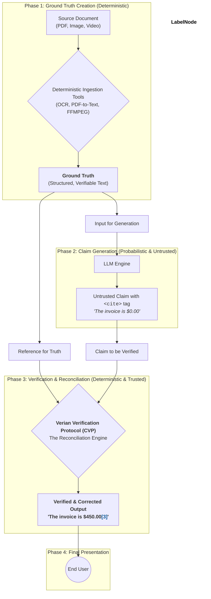

   
  <h1 align="center">Verian</h1>
  

    The Standard for Verifiable AI
  

  

    
    
    
    
  

---

## The Problem: The Crisis of Trust in AI

Generative AI holds immense promise, but its utility is critically undermined by a single, pervasive flaw: **hallucination**. An AI that confidently presents unverified or fabricated information is not just unhelpful; it's a liability. As AI becomes more integrated into high-stakes domains like healthcare, finance, and law, an unverified answer is an unacceptable risk that erodes trust and hinders adoption.

## The Solution: The Verian Standard

**Verian** is an open standard and verification protocol designed to ground generative AI in objective reality.

Instead of treating the AI's output as an opaque, probabilistic black box, Verian provides a framework for making AI claims **transparent, auditable, and deterministically verifiable** against source documents. This repository is the future home for the documentation, specifications, and reference implementations of the Verian Standard.

## The Three Concepts of Verification

The Verian Standard is built on a foundation of three core concepts, which are applied in sequence to any AI-generated claim.

### 1. Does it exist? (Existence Verification)
This is the first and most fundamental check, designed to combat blatant hallucinations. The protocol uses deterministic tools (like literal text search) to answer a simple question: can the source for this claim be found in the provided content? This provides **Verifiable Certainty**.

### 2. Is the prediction in good faith? (Contextual Integrity)
A claim can be factually present but contextually wrong. This concept combats subtle hallucinations by analyzing the context of the verified information. For example, if a medical record from 10 years ago states a patient is "age 40," a good faith presentation would be "age 50," not "age 40." This ensures **Principled Context**.

### 3. Can the prediction be interpreted in bad faith? (Adversarial Resilience)
This final check addresses ambiguity that could be exploited through error or malice. For example, a date like "12/01/00" can be interpreted differently in the US vs. Europe. The protocol flags these ambiguities, which are then resolved and noted for user transparency. This provides an additional layer of **Principled Context** and robustness.

## How It Works: Visualizing Trust

The process is simple: an AI model generates text with a `<cite>` tag containing source metadata. The Verian Verification Protocol (CVP) then independently validates this claim against the source. The CVP corrects the text if necessary and renders the final, truthful statement with a styled citation marker that transparently indicates the verification status.

### Rendered User Experience:

The final output is always clean and correct. The citation's appearance provides at-a-glance confidence that every claim is verified, while transparently noting the journey.

> According to the file, the patient was admitted on **December 1, 2000[1*]**. The patient, now **aged 50[2*]**, originally presented with acute pharyngitis. The final invoice was **$450.00[3]**.

Progressive disclosure on hover or click reveals the details of any corrections or ambiguities.

*   <strong>[3] Blue</strong>: **Verified.** The claim was a direct, contextually-correct match with the source.
*   <strong>[2*] Blue, with Amber Asterisk</strong>: **Corrected.** The claim's source was found, but the CVP updated the text for contextual accuracy (e.g., calculated a current age). The asterisk invites the user to investigate.
*   <strong>[1*] Blue, with Purple Asterisk</strong>: **Ambiguity Resolved.** The source was ambiguous (e.g., unclear date format), and the CVP resolved it based on established rules. The asterisk invites the user to investigate.

## The Verian Trust Graph: A Chain of Verification

The power of Verian lies in its strict architectural separation between the **probabilistic act of generation** and the **deterministic act of verification**. The LLM's output is never blindly trusted; it is merely a proposal that must be rigorously validated by an independent, deterministic process.

**Phase 1: Ground Truth Creation (Deterministic)**
The process begins with trusted, deterministic tools. Any source document (PDF, image, etc.) is converted into a structured, searchable text format. This output is the immutable **Ground Truth**, the single source of fact for the entire system.

**Phase 2: Claim Generation (Probabilistic & Untrusted)**
The Ground Truth is fed to the LLM. The LLM's only job is to perform a creative task: generate a human-readable summary and embed the raw `<cite>` tags pointing to what it *believes* is the source. Its output is always treated as an **untrusted claim**.

**Phase 3: Verification & Reconciliation (Deterministic & Trusted)**
This is the heart of the standard. The **Verian Verification Protocol (CVP)** acts as an independent reconciliation engine. It receives two critical inputs: the **untrusted claim** from the LLM and the original **Ground Truth** from Phase 1. The CVP deterministically compares the two, applies the Three Concepts of Verification, corrects any errors or contextual inaccuracies, and resolves ambiguities.

**Phase 4: Final Presentation**
The text shown to the end user is **always the output of the trusted CVP**, never the raw output from the LLM. The CVP renders the final, corrected statement with the appropriately styled citation marker, ensuring the user only ever interacts with verified information.

## 🛡️ Inherent Resistance to Prompt Injection

This "chain of verification" architecture also provides inherent resilience against **prompt injection attacks.** An attack might trick an LLM into generating a malicious claim. However, the CVP acts as a safety checkpoint. It will independently validate the LLM's claim against the Ground Truth. When the malicious claim inevitably fails this deterministic check, the CVP will either flag it as an error or, better yet, replace it with the correct information. The attack is not only blocked; it's corrected.

## 📜 Project Status: Placeholder Phase

This repository and the Verian Standard are currently in a **pre-alpha, foundational stage.**

*   ✅ The core concepts and technical approach have been defined and validated.
*   ⏳ A formal standards body, the Verian SIG, Inc., is being incorporated to act as the neutral steward of the standard.
*   📝 The formal specification is in an early draft stage.
*   🌱 This GitHub repository is the designated public home for the standard's future development.

---

## Join the Verian SIG: Shaping the Future of Trusted AI

To ensure the Verian Standard is a truly universal and interoperable solution, it will be governed by **Verian SIG, Inc.**, an independent corporation created and directed by its members. The SIG brings together industry leaders to collaborate on the development of the standard.

Our mission is to foster a vibrant and open ecosystem capable of delivering **Verian Verified** AI output, establishing a new, universal benchmark for trust and reliability. We invite organizations to join us at one of three membership levels.

### Membership Levels & Benefits

| Level | Annual Fee | Key Benefits | Ideal For |
| :--- | :---: | :--- | :--- |
| **Promoter** | Contact for Details | • Seat on the Board of Directors • Direct the standard's strategy and roadmap • Chair Technical Working Groups (TWGs) • Ultimate influence over specification and IP | Industry leaders and pioneers committed to defining the foundational principles of verifiable AI. |
| **Contributor** | TBD | • Participate and vote in TWGs • Early access to specification drafts • Influence technical development • Right to use the "Verian Certified" logo on qualified products (once program launches) | Technology companies, AI developers, and organizations actively building solutions to produce **Verian Verified** output. |
| **Adopter** | Free | • License to use the final Verian specification • Access to official documentation and tools • Right to use the "Verian Certified" logo on qualified products (once program launches) | Any organization wanting to build and deploy solutions that generate **Verian Verified** claims. |

### Become a Founding Promoter Member

This is a ground-floor opportunity to shape the future of trusted AI. We are currently recruiting a select group of Founding Promoter Members to form the initial Board of Directors for **Verian SIG, Inc.** As a founder, you will:

*   **Define the Charter:** Establish the SIG's bylaws, IP policies, and long-term vision.
*   **Steer the Roadmap:** Set the initial priorities for the v1.0 specification.
*   **Build the Ecosystem:** Be recognized as a foundational leader in the movement for trustworthy AI.

If your organization is interested in this unique leadership opportunity, please contact our formation committee at **`contact@verian.org`**.

## 🚀 The Roadmap to a Trusted Standard

Our goal is to make **Verian Verified** output the universal expectation for reliable generative AI.

*   **Phase 1 (Current):** Recruit Founding Promoter Members to form the initial Board of Directors and ratify the charter for **Verian SIG, Inc.**
*   **Phase 2:** Open Contributor and Adopter membership. Establish Technical Working Groups (TWGs) to refine the v0.1 draft specification for producing **Verian Verified** claims. Publish the v1.0 specification.
*   **Phase 3:** Release an open-source reference implementation of the CVP. Launch the official **"Verian Certified" qualification program** to validate implementations of the standard.
*   **Phase 4:** Expand the protocol to new data types and use cases, driven by member-led working groups.

## Governance

The Verian Standard will be managed by **Verian SIG, Inc.**, a member-governed corporation ensuring neutral stewardship for the benefit of the entire ecosystem. The SIG will be led by a **Board of Directors**, elected from our Promoter members, who oversee the organization's strategy and operations. The technical evolution of the standard will be driven by member-led **Technical Working Groups (TWGs)**.

## License

The documentation and specifications in this repository are and will be licensed under the **Apache 2.0 License**. See the `LICENSE` file for details.
